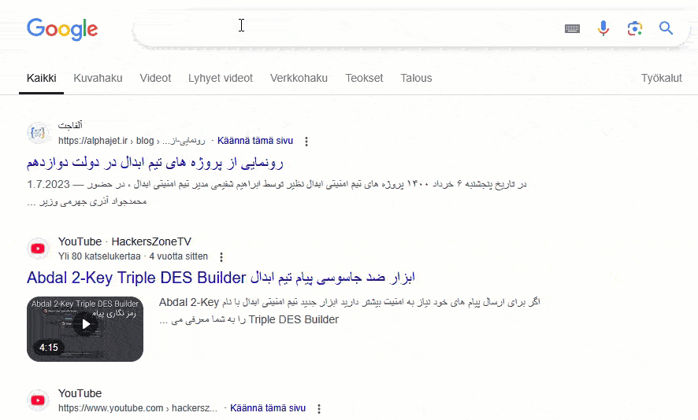
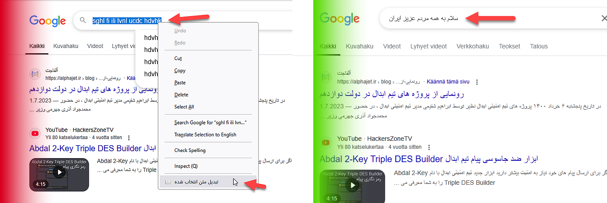
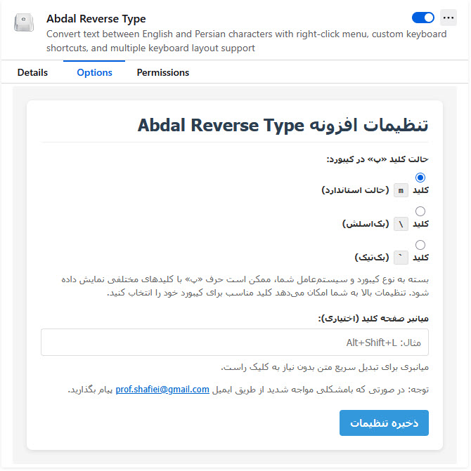

# Abdal Reverse Type - تبدیل متن فارسی به انگلیسی و برعکس

  

  

  

[🇺🇸 English Version](README_en.md)

## 📝 توضیحات

سرت پایینه و کیبوردت روی انگلیسیه، ولی داری فارسی تایپ می‌کنی؟ نگران نباش! 😎  
این افزونه با یه کلیک متن رو برعکس میکنه و درستش میکنه! دیگه نیازی نیست پاک کنی و از نو بنویسی. سریع، هوشمند و فوق‌العاده کاربردی! 🚀🔥

### ✅ این افزونه چیکار می‌کنه؟
افزونه‌ای برای مرورگر که به شما امکان می‌دهد متن انتخاب‌شده را بین حروف فارسی و انگلیسی تبدیل کنید.

این افزونه در هر جایی از مرورگر کار می‌کند، از جمله:
- 🖥 **متن عادی در صفحات وب**
- 🔤 **فیلدهای ورودی (Input)**
- 📝 **جعبه‌های متنی (Textarea)**
- ✉️ **ویرایشگرهای متنی (مثل Gmail)**

⚡ سریع، راحت و بدون دردسر! فقط یک کلیک و همه‌چیز درست میشه! 🚀🔥

## 🚀 نحوه استفاده
1. متن مورد نظر خود را انتخاب کنید
2. روی متن انتخاب شده راست کلیک کنید
3. گزینه "تبدیل متن انتخاب شده" را انتخاب کنید
4. متن به صورت خودکار تبدیل می‌شود

### ⌨️ کلیدهای میانبر
حالا می‌توانید از کلیدهای میانبر سفارشی برای تبدیل سریع متن استفاده کنید:
1. روی آیکون افزونه کلیک کنید تا تنظیمات باز شود
2. کلید میانبر دلخواه خود را تنظیم کنید (مثلاً Alt+Shift+L)
3. تنظیمات را ذخیره کنید
4. متن را انتخاب کرده و کلید میانبر را فشار دهید تا تبدیل شود

### 🎛️ گزینه‌های چیدمان کیبورد
افزونه اکنون از چیدمان‌های مختلف کیبورد فارسی پشتیبانی می‌کند:
- چیدمان استاندارد (حرف پ روی کلید 'm')
- چیدمان بک‌اسلش (حرف پ روی کلید '\')
- چیدمان بک‌تیک (حرف پ روی کلید '`')

چیدمان دلخواه خود را در تنظیمات پیکربندی کنید!

## ⚙️ نصب
1. افزونه را از [فروشگاه افزونه‌های مرورگر](https://addons.mozilla.org/en-US/firefox/addon/abdal-reverse-type/) دانلود کنید
2. روی دکمه "نصب" کلیک کنید
3. به افزونه اجازه دسترسی‌های لازم را بدهید
4. از افزونه استفاده کنید!

## 🔧 پیکربندی
1. روی آیکون افزونه در نوار ابزار مرورگر خود کلیک کنید
2. چیدمان کیبورد دلخواه خود را برای حرف "پ" فارسی تنظیم کنید
3. کلید میانبر دلخواه خود را پیکربندی کنید
4. روی "ذخیره تنظیمات" کلیک کنید
5. تغییرات شما فوراً در تمام تب‌های باز اعمال می‌شود

## 🐛 گزارش مشکلات
اگر با مشکلی مواجه شدید یا در پیکربندی مشکل دارید، لطفاً از طریق ایمیل Prof.Shafiei@Gmail.com با ما در تماس باشید. همچنین می‌توانید مشکلات را در GitLab یا GitHub گزارش دهید.

## ❤️ حمایت مالی
اگر این پروژه برای شما مفید بود و مایل به حمایت از توسعه بیشتر هستید، لطفاً در نظر داشته باشید که کمک مالی کنید:
- [اینجا اهدا کنید](https://alphajet.ir/abdal-donation)

## 🤵 برنامه‌نویس
ساخته شده با عشق توسط **ابراهیم شفیعی (EbraSha)**
- **ایمیل**: Prof.Shafiei@Gmail.com
- **تلگرام**: [@ProfShafiei](https://t.me/ProfShafiei)

## 📜 مجوز
این پروژه تحت مجوز GPLv2 or later منتشر شده است. 