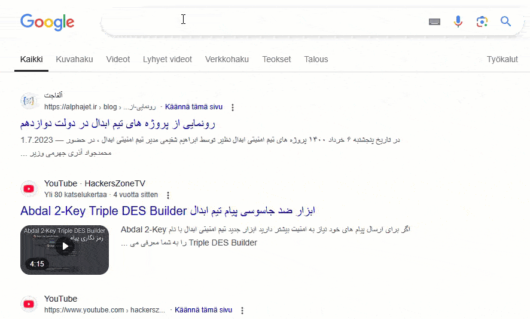
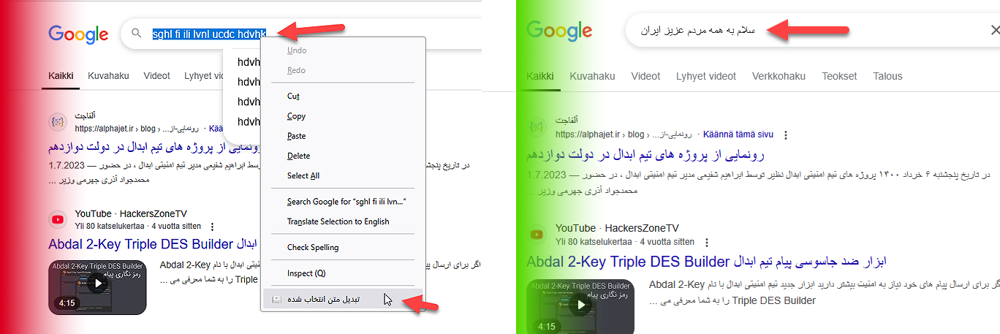
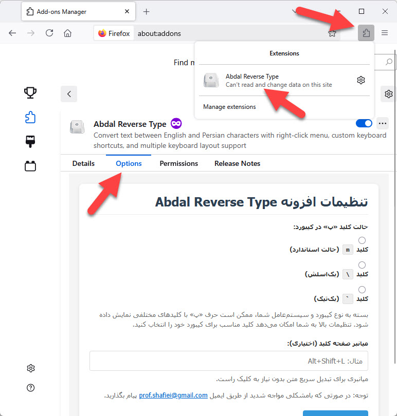

# Abdal Reverse Type - Persian/English Text Converter

  

  

  

[🇮🇷 نسخه فارسی](README_fa.md)

## 📝 Description

Your head is down, your keyboard is in English, but you're typing in Persian? Don't worry! 😎 
With just one click, this add-on fixes everything! No need to delete and rewrite. Fast, smart, and super useful! 🚀🔥

### ✅ What does this add-on do?
A browser extension that allows you to convert selected text between Persian and English characters.

This add-on works everywhere in the browser, including:
- 🖥 **Regular text on web pages**
- 🔤 **Input fields**
- 📝 **Text areas**
- ✉️ **Text editors (like Gmail)**

⚡ Fast, easy, and hassle-free! Just one click and everything is fixed! 🚀🔥

## 🚀 How to Use
1. Select any text you want to convert
2. Right-click on the selected text
3. Choose "Convert Selected Text"
4. The text will be automatically converted

### ⌨️ Keyboard Shortcuts
You can now use custom keyboard shortcuts for quick text conversion:
1. Click on the extension icon to open settings
2. Set your preferred keyboard shortcut (e.g., Alt+Shift+L)
3. Save settings
4. Select text and press your keyboard shortcut to convert

### 🎛️ Keyboard Layout Options
The extension now supports different Persian keyboard layouts:
- Standard layout (پ on 'm' key)
- Backslash layout (پ on '\' key)
- Backtick layout (پ on '`' key)

Configure your preferred layout in the settings!

## ⚙️ Installation
1. Download the extension from the [Browser Extension Store](https://addons.mozilla.org/en-US/firefox/addon/abdal-reverse-type/)
2. Click on "Install"
3. Grant the necessary permissions
4. Start using the extension!

## 🔧 Configuration

  

1. Click on the extension icon in your browser toolbar
2. Set your preferred keyboard layout for the Persian "پ" character
3. Configure your preferred keyboard shortcut
4. Click "Save Settings"
5. Your changes will apply immediately to all open tabs

## 🐛 Reporting Issues
If you encounter any issues or have configuration problems, please reach out via email at Prof.Shafiei@Gmail.com. You can also report issues on GitLab or GitHub.

## ❤️ Donation
If you find this project helpful and would like to support further development, please consider making a donation:
- [Donate Here](https://alphajet.ir/abdal-donation)

## 🤵 Programmer
Handcrafted with Passion by **Ebrahim Shafiei (EbraSha)**
- **E-Mail**: Prof.Shafiei@Gmail.com
- **Telegram**: [@ProfShafiei](https://t.me/ProfShafiei)

## 📜 License
This project is licensed under the GPLv2 or later License. 